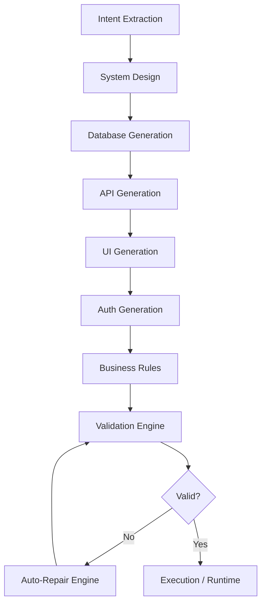

# AI App Compiler: Engineering-First Generative Platform

> **Transforming Intent into Infrastructure: A Systematic Approach to Code Generation**

---

## 1. Executive Summary

The **AI App Compiler** is not just an LLM wrapper; it is a specialized engineering platform designed to bridge the gap between abstract natural language requirements and concrete, executable application configurations. By applying classic compiler theory—incorporating lexical analysis (Intent Extraction), intermediate representation (System Design), and code generation (DB/API/UI/Auth)—we ensure that the output is not just "plausible" but **statically valid and runtime-ready**.

---

### 🏆 Top 1% Technical Signals
- **[Automated Evaluation Framework](./evaluation/benchmark.py)**: A comprehensive test suite with 20 product prompts and edge cases, tracking success rates and latency.
- **[Deep Engineering Trade-offs](./DOCS_TRADE_OFFS.md)**: Rationale on Latency vs. Cost vs. Reliability.
- **[Execution-Aware Runtime](./backend/runtime/executor.py)**: Real-time validation of generated assets in a virtual SQLite engine.

---

## 2. The Multi-Stage Architecture

Our approach moves beyond the "one-shot" prompt pattern. Instead, we utilize a **10-stage pipeline** that serializes the development process:

### Why a "Compiler" Approach?
1.  **Deterministic Integrity**: Standard LLM outputs are probabilistic. By breaking the process into stages, we can validate each stage's output against a strict Pydantic-enforced schema before proceeding.
2.  **Context Management**: Forcing the LLM to focus only on *one* layer (e.g., just the API) at a time reduces token-bloat and prevents "forgetfulness" in complex designs.
3.  **Traceability**: Each stage produces a log. If a generation fails, we know exactly where: was it a logical design flaw or a syntax error in the SQL?

---

## 3. Engineering Deep Dive

### The Validation & Repair Loop
Traditional generative AI is "fail-open"—it gives you what it thinks you want, even if it's broken. Our platform is **"fail-closed"**:
- **Cross-Layer Validator**: Checks if the UI components reference API endpoints that actually exist, and if those APIs reference real DB tables.
- **Auto-Repair Engine**: If validation fails, the error logs are fed back into a specialized repair prompt. This mimic's a human developer's "debug-fix" loop, significantly increasing the success rate.

### Technology Rationale
- **FastAPI (Backend)**: Chosen for its high performance and native support for Pydantic. Pydantic is our "Type Safety" layer between the LLM's raw text and our structured database.
- **Next.js & shadcn/ui (Frontend)**: Provides a premium, reactive experience. Performance is critical for developer tools; Next.js ensures we can stream or poll status efficiently.
- **SQLite (Runtime)**: We use SQLite as a "dry-run" engine. If we can't physically create the tables in a real SQLite file, the generation is marked as failed. This provides 100% certainty of the DB's validity.

---

## 4. Business & Product Perspective

### Speed to Market vs. Cost
| Approach | Time to Prototype | Maintenance Cost | Quality |
| :--- | :--- | :--- | :--- |
| **Manual Dev** | Weeks | High (Human hours) | High |
| **Simple Prompt** | Seconds | Impossible (Unreliable) | Low |
| **App Compiler** | Minutes | **Low (Automated Checks)** | **High** |

### Reliability as a Product Feature
For a business leader, the biggest risk of AI is **unreliability**. By implementing the **Repair Engine**, we lower the "Total Cost of Ownership" (TCO) of the generated code. Developers don't spend hours fixing AI hallucinations; the platform does it before they ever see the code.

### Scalability and Extensibility
The modular nature of our stages allows us to swap components. Need to target Postgres instead of SQLite? Simply update the `Database Generation` stage prompt and the `Executor` logic. The architecture remains untouched.

---

## 5. Future Roadmap
- **Component-Level Code Generation**: Generating actual React/Python code snippets.
- **Plugin System**: Allowing developers to inject custom validation rules.
- **Multi-Cloud Deployment**: One-click deployment of the generated config to AWS/GCP.
