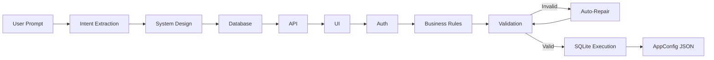

# AI App Compiler

**Transform natural-language product requirements into validated, executable application blueprints.**

A multi-stage AI compiler that turns prompts like *"Build a CRM with login, contacts, dashboard, and role-based access"* into structured outputs — database schema, REST API, UI layout, auth model, and business rules — with cross-layer validation, auto-repair, and SQLite dry-run execution.

---

## Live Demo

| Service | URL |
| :--- | :--- |
| **Frontend (Vercel)** | [demo-task-ai-engineer.vercel.app](https://demo-task-ai-engineer.vercel.app) |
| **Backend API (Render)** | [demo-task-ai-engineer.onrender.com](https://demo-task-ai-engineer.onrender.com) |
| **API Docs (Swagger)** | [demo-task-ai-engineer.onrender.com/docs](https://demo-task-ai-engineer.onrender.com/docs) |
| **Source Code** | [github.com/madhan175/-DEMO-TASK-AI-ENGINEER-](https://github.com/madhan175/-DEMO-TASK-AI-ENGINEER-) |

> **For interviewers:** You can test the live demo above **without any API key** — generation runs on the deployed Render backend. Only follow the steps below if you want to run the project locally on your machine.

---

## For Interviewers — Google API Key Setup

This project uses **Google Gemini** for AI generation. If you want to run the backend locally (not required for the live demo), you need a free API key from **Google AI Studio**.

### Option A — Use the live demo (no API key needed)

1. Open [demo-task-ai-engineer.vercel.app](https://demo-task-ai-engineer.vercel.app)
2. Enter a prompt (e.g. *"Build a CRM with login, contacts, and dashboard"*)
3. Click **Generate Application** and watch the 10-stage pipeline

The API key is already configured on the production Render backend. **You do not need to create or share any keys.**

---

### Option B — Run locally (requires your own API key)

#### Step 1 — Go to Google AI Studio

Open: **[https://aistudio.google.com/apikey](https://aistudio.google.com/apikey)**

Sign in with any Google account (Gmail).

#### Step 2 — Create an API key

1. Click **"Create API key"**
2. Choose **"Create API key in new project"** (or select an existing Google Cloud project)
3. Copy the key — it looks like: `AIzaSyD...` (about 39 characters)


#### Step 3 — Add the key to the backend

Create or edit `backend/.env`:

```env
GOOGLE_API_KEY=AIzaSyD_paste_your_key_here
GEMINI_MODEL=gemini-2.0-flash
PORT=8000
HOST=0.0.0.0
```

Replace `AIzaSyD_paste_your_key_here` with the key you copied.

#### Step 4 — Start the backend and test

```bash
cd backend
venv\Scripts\activate        # Windows
# source venv/bin/activate   # macOS / Linux
uvicorn main:app --reload
```

Open [http://localhost:8000/docs](http://localhost:8000/docs) — if it loads, the backend is ready.

---

### API key — important notes for reviewers

| Topic | Details |
| :--- | :--- |
| **Cost** | Google AI Studio offers a **free tier** for Gemini API. No credit card required for basic usage. |
| **Security** | The API key is **never committed to GitHub**. It lives only in `backend/.env` (gitignored) or Render's secret env vars. |
| **Frontend** | The Google API key is used **only on the backend**. The frontend never sees or needs `GOOGLE_API_KEY`. |
| **Where it is read** | `backend/llm/gemini_provider.py` → `os.getenv("GOOGLE_API_KEY")` |
| **Production** | Live demo key is set in **Render Dashboard → Environment → `GOOGLE_API_KEY`** (not in the repo) |
| **Quota errors** | If you see `429` or `RESOURCE_EXHAUSTED`, wait a minute and retry — free tier has rate limits |

### Quick copy — `backend/.env` template

```env
# Get your key from: https://aistudio.google.com/apikey
GOOGLE_API_KEY=your_key_here
GEMINI_MODEL=gemini-2.0-flash
PORT=8000
HOST=0.0.0.0
```

---

## Table of Contents

1. [For Interviewers — Google API Key Setup](#for-interviewers--google-api-key-setup)
2. [Problem Statement](#problem-statement)
3. [Solution](#solution)
4. [Key Features](#key-features)
5. [Architecture](#architecture)
6. [Tech Stack](#tech-stack)
7. [Full Project Structure](#full-project-structure)
8. [Getting Started (Local)](#getting-started-local)
9. [Environment Variables](#environment-variables)
10. [Deployment](#deployment)
11. [API Reference](#api-reference)
12. [Evaluation & Benchmarking](#evaluation--benchmarking)
13. [Engineering Highlights](#engineering-highlights)
14. [Design Trade-offs](#design-trade-offs)
15. [Known Limitations](#known-limitations)
16. [Future Roadmap](#future-roadmap)
17. [Further Reading](#further-reading)

---

## Problem Statement

Single-shot LLM prompting for full-stack app generation fails in production because:

- **Outputs are non-deterministic** — column names, endpoint paths, and entity shapes drift between runs.
- **There is no cross-layer consistency** — UI forms may reference APIs that do not exist; APIs may reference tables that were never defined.
- **Failures are opaque** — when generation breaks, you cannot tell whether the bug is in the DB layer, API layer, or auth model.
- **There is no recovery** — malformed JSON or logical inconsistencies require a full regeneration.

This project treats app generation as a **compiler problem**, not a chat problem.

---

## Solution

The **AI App Compiler** serializes software design into a **10-stage pipeline**. Each stage has a strict Pydantic contract, real-time status tracking, and explicit error handling. After generation, a deterministic validator checks cross-layer consistency, an auto-repair engine fixes mismatches, and a runtime executor dry-runs the database schema in SQLite.



**Example input:**

> Build a CRM with login, contacts, dashboard, role-based access, and premium plan with payments. Admins can see analytics.

**Example output:** A complete `AppConfig` containing architecture entities, normalized SQLite tables, REST endpoints, UI pages/components, auth roles/permissions, and business rules — all validated and executable.

---

## Key Features

| Feature | Description |
| :--- | :--- |
| **10-Stage Pipeline** | Intent → Design → DB → API → UI → Auth → Rules → Validation → Repair → Execution |
| **Schema-Enforced LLM Output** | Pydantic models + Gemini JSON mode with schema sanitization for API compatibility |
| **Cross-Layer Validator** | Deterministic checks: UI data sources map to real APIs; auth matrix references real roles |
| **Delta-Repair Engine** | Feeds validation errors back to the LLM for targeted fixes instead of full regeneration |
| **Runtime Execution** | Creates tables in a real SQLite file to prove the generated schema is valid SQL |
| **Real-Time Dashboard** | Next.js UI with live pipeline stepper, architecture explorer, and error surfacing |
| **Evaluation Suite** | 20 benchmark prompts (standard + edge cases) with latency and success-rate tracking |
| **Pluggable LLM Providers** | Gemini (production) and Ollama (local) via a shared provider interface |

---

## Architecture

```
┌─────────────────────────────────────────────────────────────┐
│                    FRONTEND (Next.js 16)                     │
│  Prompt Input → Pipeline Stepper → Config Explorer → Analytics│
└────────────────────────────┬────────────────────────────────┘
                             │ REST (poll /status every 2s)
┌────────────────────────────▼────────────────────────────────┐
│                    BACKEND (FastAPI)                          │
│  POST /generate  →  BackgroundTasks  →  GenerationService     │
│  GET  /status    ←  PipelineStatus (per-stage output/errors)  │
│  GET  /project   ←  AppConfig (full generated blueprint)      │
└────────────────────────────┬────────────────────────────────┘
                             │
┌────────────────────────────▼────────────────────────────────┐
│                   COMPILER PIPELINE                           │
│  AppCompiler → Validator → RepairEngine → RuntimeExecutor     │
└─────────────────────────────────────────────────────────────┘
```

### Pipeline Stages

| # | Stage | Input | Output |
| :-: | :--- | :--- | :--- |
| 0 | Intent Extraction | Raw prompt | Project name, intent summary, assumptions |
| 1 | System Design | Intent + assumptions | Architecture entities + system flow |
| 2 | Database Generation | Architecture | SQLite tables, columns, relationships |
| 3 | API Generation | Architecture + DB | REST endpoints with request/response shapes |
| 4 | UI Generation | API + entities | Pages, routes, components with props |
| 5 | Auth Generation | System flow | Roles, permissions, access matrix |
| 6 | Business Rules | Architecture | Triggers, validation logic, state transitions |
| 7 | Validation | Full AppConfig | Score, error list, pass/fail |
| 8 | Repair | Validation errors | Patched AppConfig + repair log |
| 9 | Execution | AppConfig | SQLite table creation + runtime logs |

---

## Tech Stack

| Layer | Technology | Why |
| :--- | :--- | :--- |
| **Backend** | Python 3.12, FastAPI, Pydantic v2 | Async API, native schema validation, OpenAPI docs |
| **LLM** | Google Gemini (`google-genai` SDK) | Structured JSON output with response schema mode |
| **Runtime** | SQLite | Dry-run proof that generated DDL is valid |
| **Frontend** | Next.js 16, React 19, TypeScript | App Router, server/client components, fast polling |
| **UI** | Tailwind CSS 4, shadcn/ui, Lucide | Modern dashboard with pipeline visualization |
| **Deployment** | Render (backend), Vercel (frontend) | Zero-config deploy from GitHub |
| **Process Manager** | Gunicorn + Uvicorn workers (prod) | Production-grade async worker model |

---

## Full Project Structure

```
-DEMO-TASK-AI-ENGINEER-/
│
├── README.md                          # This file — setup, architecture, interview docs
├── ARCHITECTURE.md                    # Deep-dive system design rationale
├── DOCS_TRADE_OFFS.md                 # Latency vs. cost vs. reliability analysis
├── render.yaml                        # Root Render deploy config (rootDir: backend)
├── .gitignore                         # Ignores .env, __pycache__, venv, runtime DB
├── AI app.code-workspace              # VS Code / Cursor workspace file
│
├── backend/                           # Python FastAPI compiler API
│   ├── main.py                        # FastAPI app, CORS, REST routes (/generate, /status, …)
│   ├── requirements.txt               # Python dependencies
│   ├── render.yaml                      # Backend Render deploy config
│   ├── .env.example                   # Template for local backend env (copy → .env)
│   ├── .env                           # Local secrets (gitignored — create manually)
│   ├── __init__.py
│   │
│   ├── api/                           # (reserved for future route modules)
│   ├── utils/                         # (reserved for shared utilities)
│   │
│   ├── llm/                           # LLM provider abstraction
│   │   ├── __init__.py
│   │   ├── base_provider.py           # Abstract generate_json() interface
│   │   ├── gemini_provider.py         # Google Gemini JSON-mode + schema sanitization
│   │   └── ollama_provider.py         # Local Ollama fallback (model: "ollama")
│   │
│   ├── pipeline/
│   │   ├── __init__.py
│   │   └── compiler.py                # AppCompiler — 10-stage generation pipeline
│   │
│   ├── services/
│   │   ├── __init__.py
│   │   └── generation_service.py      # Orchestrates compile → validate → repair → execute
│   │
│   ├── schemas/                       # Pydantic models (strict contracts between stages)
│   │   ├── __init__.py
│   │   ├── app_config.py              # AppConfig, PipelineStatus, ArchitectureSchema
│   │   ├── database.py                # DBSchema, DBTable, DBColumn
│   │   ├── api.py                     # APISchema, APIEndpoint
│   │   ├── ui.py                      # UISchema, UIPage, UIComponent
│   │   ├── auth.py                    # AuthSchema, AuthRole, Permission
│   │   └── business_rules.py          # RulesSchema, BusinessRule
│   │
│   ├── validation/
│   │   ├── __init__.py
│   │   └── validator.py               # Cross-layer consistency checks (deterministic)
│   │
│   ├── repair/
│   │   ├── __init__.py
│   │   └── repair_engine.py           # LLM-assisted delta repair from validation errors
│   │
│   ├── runtime/
│   │   ├── __init__.py
│   │   └── executor.py                # SQLite dry-run — CREATE TABLE for every generated table
│   │
│   └── database/
│       ├── projects/                  # Saved AppConfig JSON per project_id (auto-created)
│       │   └── {uuid}.json            # Example: f4cdfe46-582d-4824-80df-8e8ca625476d.json
│       └── runtime_test.db            # Ephemeral SQLite file from execution stage (gitignored)
│
├── frontend/                          # Next.js 16 dashboard
│   ├── package.json
│   ├── package-lock.json
│   ├── next.config.ts
│   ├── tsconfig.json
│   ├── postcss.config.mjs
│   ├── eslint.config.mjs
│   ├── components.json                # shadcn/ui configuration
│   ├── .gitignore
│   ├── .env.example                   # Template for frontend env (copy → .env.local)
│   ├── .env.local                     # Local frontend env (gitignored — create manually)
│   │
│   ├── public/                        # Static assets (SVG icons)
│   │   ├── next.svg
│   │   ├── vercel.svg
│   │   └── …
│   │
│   └── src/
│       ├── app/                       # Next.js App Router pages
│       │   ├── layout.tsx             # Root layout + global styles
│       │   ├── page.tsx               # Home — main generation dashboard
│       │   ├── globals.css
│       │   ├── analytics/page.tsx     # Generation analytics view
│       │   ├── evaluation/page.tsx    # Evaluation results view
│       │   └── projects/page.tsx      # Past projects list
│       │
│       ├── components/
│       │   ├── dashboard/
│       │   │   ├── dashboard.tsx          # Main dashboard — prompt, tabs, polling
│       │   │   ├── dashboard-panels.tsx   # Validation / repair / execution panels
│       │   │   ├── generation-header.tsx  # Page header
│       │   │   └── pipeline-stepper.tsx   # 10-stage progress stepper UI
│       │   ├── sidebar/
│       │   │   └── app-sidebar.tsx        # Navigation sidebar
│       │   └── ui/                          # shadcn/ui primitives (button, card, tabs, …)
│       │
│       ├── hooks/
│       │   └── use-mobile.ts
│       ├── lib/
│       │   ├── api.ts                 # Backend API client (generate, status, project)
│       │   └── utils.ts               # Tailwind cn() helper
│       └── types/
│           └── app-config.ts          # TypeScript types mirroring backend schemas
│
└── evaluation/                        # Automated benchmark suite
    ├── manifest.json                  # Master list of 20 test prompts
    ├── benchmark.py                   # Runs all prompts, records latency + success
    ├── run_evaluation.py              # Evaluation runner wrapper
    ├── setup_dataset.py               # Dataset setup helper
    ├── prompts/
    │   ├── normal_prompts.json        # Standard product scenarios
    │   └── edge_cases.json            # Vague, conflicting, malicious prompts
    └── results/                       # Benchmark output (auto-generated)
        ├── report.json
        └── projects/                  # Per-benchmark AppConfig JSON files
```

### Key Files at a Glance

| File | Purpose |
| :--- | :--- |
| `backend/main.py` | API entry point — starts generation in background, serves status |
| `backend/pipeline/compiler.py` | Core 10-stage LLM pipeline |
| `backend/llm/gemini_provider.py` | Gemini integration with JSON schema mode |
| `frontend/src/lib/api.ts` | Reads `NEXT_PUBLIC_API_BASE_URL` / `NEXT_PUBLIC_API_URL` |
| `frontend/src/app/page.tsx` | Main UI — prompt input + live pipeline polling |
| `evaluation/benchmark.py` | Run 20-prompt quality benchmark |

---

## Getting Started (Local)

### Prerequisites

| Tool | Version | Purpose |
| :--- | :--- | :--- |
| **Python** | 3.12+ | Backend API & compiler pipeline |
| **Node.js** | 20+ | Frontend dashboard |
| **npm** | 10+ | Frontend package manager |
| **Google API Key** | — | Gemini LLM access → [Google AI Studio](https://aistudio.google.com/apikey) |

### Quick Setup Checklist

```
[ ] Clone repo
[ ] Create backend/.env from backend/.env.example
[ ] pip install -r backend/requirements.txt
[ ] Start backend on http://localhost:8000
[ ] npm install in frontend/
[ ] (Optional) Create frontend/.env.local from frontend/.env.example
[ ] Start frontend on http://localhost:3000
[ ] Test generation with a sample prompt
```

---

### Step 1 — Clone the repository

```bash
git clone https://github.com/madhan175/-DEMO-TASK-AI-ENGINEER-.git
cd "-DEMO-TASK-AI-ENGINEER-"
```

---

### Step 2 — Backend setup

```bash
cd backend
python -m venv venv
```

**Activate the virtual environment:**

```bash
# Windows (PowerShell / CMD)
venv\Scripts\activate

# macOS / Linux
source venv/bin/activate
```

**Install dependencies:**

```bash
pip install -r requirements.txt
```

**Create environment file:**

```bash
# Windows
copy .env.example .env

# macOS / Linux
cp .env.example .env
```

Edit `backend/.env` and paste your Google API key (get one free at [aistudio.google.com/apikey](https://aistudio.google.com/apikey)):

```env
GOOGLE_API_KEY=AIzaSyD_paste_your_key_here
GEMINI_MODEL=gemini-2.0-flash
PORT=8000
HOST=0.0.0.0
```

> See [For Interviewers — Google API Key Setup](#for-interviewers--google-api-key-setup) for full step-by-step instructions.

**Start the backend:**

```bash
# Development (auto-reload)
uvicorn main:app --reload

# Or using Python directly
python main.py
```

**Verify backend is running:**

| Check | URL |
| :--- | :--- |
| Health / root | [http://localhost:8000](http://localhost:8000) |
| Swagger API docs | [http://localhost:8000/docs](http://localhost:8000/docs) |
| Test analytics | [http://localhost:8000/analytics](http://localhost:8000/analytics) |

---

### Step 3 — Frontend setup

Open a **second terminal** (keep the backend running):

```bash
cd frontend
npm install
```

**Create environment file (recommended):**

```bash
# Windows
copy .env.example .env.local

# macOS / Linux
cp .env.example .env.local
```

`frontend/.env.local` should contain:

```env
NEXT_PUBLIC_API_BASE_URL=http://localhost:8000
```

> **Note:** If you skip `.env.local`, the frontend auto-defaults to `http://localhost:8000` in development mode.

**Start the frontend:**

```bash
npm run dev
```

Open [http://localhost:3000](http://localhost:3000), enter a prompt, and click **Generate Application**.

---

### Step 4 — Run evaluation benchmark (optional)

```bash
cd evaluation

# Ensure backend/.env exists with a valid GOOGLE_API_KEY
python benchmark.py
```

Results are written to `evaluation/results/report.json`.

---

### Step 5 — Use Ollama locally (optional)

If you prefer a local LLM instead of Gemini:

1. Install and run [Ollama](https://ollama.com/) with a model (e.g. `llama3`)
2. In the frontend, select **Ollama** as the model provider when generating
3. No `GOOGLE_API_KEY` needed for Ollama runs (backend still starts normally)

---

## Environment Variables (Complete Reference)

### Overview — Which file goes where

| Environment | File / Platform | Who reads it |
| :--- | :--- | :--- |
| **Local backend** | `backend/.env` | FastAPI (`python-dotenv` in `main.py`) |
| **Local frontend** | `frontend/.env.local` | Next.js at build/dev time |
| **Production backend** | Render → Environment tab | Gunicorn / FastAPI on Render |
| **Production frontend** | Vercel → Settings → Environment Variables | Next.js at build time on Vercel |

> **Never commit** `.env`, `backend/.env`, or `frontend/.env.local` — they are gitignored. Only commit `.env.example` templates.

---

### Backend — `backend/.env`

Copy from `backend/.env.example`:

```env
GOOGLE_API_KEY=your_google_api_key_here
GEMINI_MODEL=gemini-2.0-flash
PORT=8000
HOST=0.0.0.0
```

| Variable | Required | Default | Description |
| :--- | :---: | :--- | :--- |
| `GOOGLE_API_KEY` | **Yes** | — | Google Gemini API key from [AI Studio](https://aistudio.google.com/apikey). Used by `GeminiProvider`. |
| `GEMINI_MODEL` | No | `gemini-3.5-flash` | Gemini model ID passed to `google-genai` SDK. Examples: `gemini-2.0-flash`, `gemini-2.5-flash`. |
| `PORT` | No | `8000` | HTTP port. Render sets this automatically in production. |
| `HOST` | No | `0.0.0.0` | Bind address. Use `0.0.0.0` for Docker/Render/cloud. |

**Where it is loaded:**

```python
# backend/main.py
from dotenv import load_dotenv
load_dotenv()
```

```python
# backend/llm/gemini_provider.py
self.api_key = api_key or os.getenv("GOOGLE_API_KEY")
self.model_name = model_name or os.getenv("GEMINI_MODEL") or "gemini-3.5-flash"
```

---

### Frontend — `frontend/.env.local`

Copy from `frontend/.env.example`:

```env
# Backend API URL — use either variable name (both are supported)
NEXT_PUBLIC_API_BASE_URL=http://localhost:8000
# NEXT_PUBLIC_API_URL=http://localhost:8000
```

| Variable | Required (local) | Required (prod) | Description |
| :--- | :---: | :---: | :--- |
| `NEXT_PUBLIC_API_BASE_URL` | No* | **Yes** | Full URL of the FastAPI backend (no trailing slash). |
| `NEXT_PUBLIC_API_URL` | No* | **Yes** | Alias for `NEXT_PUBLIC_API_BASE_URL` — either name works. |

\* In `NODE_ENV=development`, defaults to `http://localhost:8000` if both are unset.

**Where it is read:**

```typescript
// frontend/src/lib/api.ts
const API_BASE_URL =
    process.env.NEXT_PUBLIC_API_BASE_URL ??
    process.env.NEXT_PUBLIC_API_URL ??
    (process.env.NODE_ENV === "development" ? "http://localhost:8000" : undefined);
```

> **`NEXT_PUBLIC_` prefix is required** — Next.js only exposes env vars with this prefix to browser-side code.

---

### Production — Render (Backend)

Set these in **Render Dashboard → your service → Environment**:

| Key | Value | Notes |
| :--- | :--- | :--- |
| `GOOGLE_API_KEY` | `AIza...` (your key) | **Required.** Mark as secret. |
| `GEMINI_MODEL` | `gemini-2.0-flash` | Optional. |
| `HOST` | `0.0.0.0` | Already in `render.yaml`. |
| `PORT` | *(auto)* | Render injects `$PORT` automatically. |

**Do NOT set on Render:**

| Variable | Why |
| :--- | :--- |
| `NEXT_PUBLIC_API_BASE_URL` | Frontend-only — not used by the backend |
| `NEXT_PUBLIC_API_URL` | Frontend-only — not used by the backend |

---

### Production — Vercel (Frontend)

Set in **Vercel Dashboard → Project → Settings → Environment Variables**:

| Key | Value (example) | Environments |
| :--- | :--- | :--- |
| `NEXT_PUBLIC_API_BASE_URL` | `https://demo-task-ai-engineer.onrender.com` | Production, Preview |

Or use the alias:

| Key | Value (example) |
| :--- | :--- |
| `NEXT_PUBLIC_API_URL` | `https://demo-task-ai-engineer.onrender.com` |

**Critical rules:**

1. Point to your **Render backend URL**, not your Vercel frontend URL.
2. No trailing slash: `https://demo-task-ai-engineer.onrender.com` ✅ — not `...com/` ❌
3. **Redeploy** after changing env vars — Next.js bakes `NEXT_PUBLIC_*` values in at build time.

**Do NOT set on Vercel:**

| Variable | Why |
| :--- | :--- |
| `GOOGLE_API_KEY` | Belongs on the backend only — never expose LLM keys to the browser |

---

### Environment Troubleshooting

| Error | Cause | Fix |
| :--- | :--- | :--- |
| `API Base URL not configured` | Frontend missing `NEXT_PUBLIC_API_*` in production | Set `NEXT_PUBLIC_API_BASE_URL` on Vercel → redeploy |
| `Google API Key not found` | Missing `GOOGLE_API_KEY` in backend | Add key to `backend/.env` or Render env |
| `Generation failed: Failed to fetch` | Backend not running or wrong URL | Check backend is up; verify URL in `.env.local` |
| CORS error | Wrong backend URL or backend down | Confirm Render service is live; check `/docs` |
| Changes to `.env` not applied | Server not restarted | Restart `uvicorn` (backend) or `npm run dev` (frontend) |
| Vercel still broken after env change | Old build cached | Trigger a new deployment on Vercel |

---

## Deployment

### Backend → Render

1. Connect [GitHub repo](https://github.com/madhan175/-DEMO-TASK-AI-ENGINEER-) to [Render](https://render.com).
2. Use `backend/` as root directory (configured in root `render.yaml`).
3. Set environment variables:

   ```
   GOOGLE_API_KEY = <your-key>
   GEMINI_MODEL   = gemini-2.0-flash   (optional)
   HOST           = 0.0.0.0
   ```

4. Deploy and note the service URL: `https://demo-task-ai-engineer.onrender.com`

**Build & start commands** (from `render.yaml`):

```yaml
buildCommand: pip install -r requirements.txt
startCommand: gunicorn -w 4 -k uvicorn.workers.UvicornWorker main:app --bind 0.0.0.0:$PORT
```

### Frontend → Vercel

1. Import repo on [Vercel](https://vercel.com).
2. Set **Root Directory** to `frontend`.
3. Add environment variable:

   ```
   NEXT_PUBLIC_API_BASE_URL = https://demo-task-ai-engineer.onrender.com
   ```

4. Deploy → live at `https://demo-task-ai-engineer.vercel.app`

### CORS

The backend allows all origins (`allow_origins=["*"]` in `main.py`), so the Vercel frontend can call the Render API without extra configuration.

---

## API Reference

| Method | Endpoint | Description |
| :--- | :--- | :--- |
| `POST` | `/generate` | Start a new generation. Body: `{ "prompt": "...", "model": "gemini" }`. Returns `{ "project_id": "uuid" }`. |
| `GET` | `/status/{project_id}` | Poll pipeline status with per-stage progress, output, and errors. |
| `GET` | `/project/{project_id}` | Retrieve the full generated `AppConfig` JSON. |
| `GET` | `/analytics` | Aggregate stats: total generations, success rate, avg runtime. |

Interactive docs: `GET /docs` (Swagger UI) and `GET /redoc`.

---

## Evaluation & Benchmarking

A 20-prompt evaluation suite covers standard product scenarios and edge cases (vague prompts, conflicting requirements, oversized scope).

```bash
cd evaluation
python benchmark.py
```

The benchmark reports per-test:

- Success / failure
- End-to-end latency (seconds)
- Whether repair was triggered
- Entity, table, and endpoint counts

Test prompts are defined in `evaluation/manifest.json`. Results are saved under `evaluation/results/`.

---

## Engineering Highlights

These are the design decisions most relevant for technical interviews:

1. **Compiler, not chatbot** — Each pipeline stage is a discrete compilation pass with typed inputs/outputs, mirroring how real compilers (GCC, TypeScript) work in phases.

2. **Fail-closed validation** — The system does not ship broken configs. Cross-layer checks run deterministically after LLM generation, before the user sees output.

3. **Targeted repair, not blind retry** — Validation errors are fed to a repair prompt that fixes specific inconsistencies, reducing token cost ~60% vs. full regeneration.

4. **Schema sanitization for Gemini** — Pydantic `model_json_schema()` includes `default` and `additionalProperties` keys that Gemini's response schema mode rejects. The provider strips these recursively before API calls.

5. **Execution-aware output** — Generated DDL is executed against a real SQLite engine. If `CREATE TABLE` fails, the pipeline marks execution as failed and surfaces the SQL error.

6. **Observable pipeline** — Every stage writes status, output, and errors to `PipelineStatus`, enabling real-time UI polling and post-mortem debugging.

7. **Provider abstraction** — `BaseLLMProvider` allows swapping Gemini (cloud) and Ollama (local) without changing compiler logic.

---

## Design Trade-offs

| Decision | Chosen | Alternative | Why |
| :--- | :--- | :--- | :--- |
| Pipeline depth | 10 stages (~60–90s) | Single-shot (~10s) | ~95% validated success vs. ~15% with one-shot |
| Validation | Deterministic rules | LLM-as-judge | Predictable, fast, no extra API cost |
| Runtime proof | SQLite dry-run | Trust LLM output | Guarantees DDL is executable SQL |
| LLM model | Gemini Flash (all stages) | Tiered Pro/Flash | Simpler ops; tiered routing planned for scale |
| Storage | JSON files on disk | PostgreSQL | Sufficient for demo/MVP; easy to inspect |

Full analysis: [DOCS_TRADE_OFFS.md](./DOCS_TRADE_OFFS.md)

---

## Known Limitations

- **Render free tier cold starts** — First request after idle may take 30–60 seconds while the backend wakes up.
- **Rate limits** — Gemini API quotas can cause retries; the provider implements exponential backoff for 429 errors.
- **File-based persistence** — Project configs are stored as JSON files, not a database (adequate for demo scale).
- **Repair scope** — The repair engine sends the full config to the LLM; production would send only affected segments to save tokens.
- **Generated output is a blueprint** — The system produces structured config (schema, API spec, UI layout), not deployable React/Python source code (planned for v2).

---

## Future Roadmap

- [ ] Component-level code generation (actual React + FastAPI snippets)
- [ ] Tiered LLM routing (Pro for reasoning stages, Flash for schema drafting)
- [ ] Plugin system for custom validation rules
- [ ] PostgreSQL target alongside SQLite
- [ ] One-click deploy of generated configs to cloud providers
- [ ] Persistent project storage with search and versioning

---

## Further Reading

| Document | Description |
| :--- | :--- |
| [ARCHITECTURE.md](./ARCHITECTURE.md) | Full system design rationale, stage-by-stage breakdown, API schema design |
| [DOCS_TRADE_OFFS.md](./DOCS_TRADE_OFFS.md) | Latency vs. cost vs. reliability engineering analysis |
| [Backend API Docs](https://demo-task-ai-engineer.onrender.com/docs) | Interactive Swagger documentation |

---

## Author

**Madhan** — AI Engineer Demo Project

Built as a demonstration of production-minded AI system design: structured pipelines, schema enforcement, validation loops, and observable generation — not prompt engineering alone.

---

<p align="center">
  <sub>Submitted as part of an AI Engineer technical assessment.</sub>
</p>
